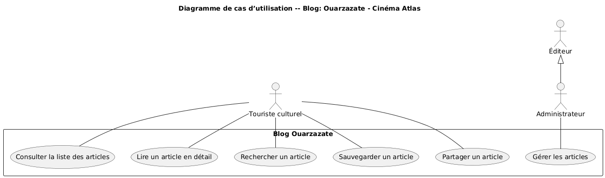

# Branche fonctionnelle

## Identifier l’utilisateur principal

### Persona – Touriste culturel (Prioritaire)

**Âge / contexte :**  
28 ans, passionné de cinéma et de voyages, vient de visiter le Maroc pour découvrir les lieux emblématiques du cinéma. Utilise principalement son smartphone pour prendre des photos et s’informer sur les sites touristiques, et son ordinateur portable pour planifier ses voyages.

**Objectif principal :**  
Découvrir l’histoire cinématographique de Ouarzazate et les studios locaux, tout en accédant à des contenus enrichissants et inspirants sur le cinéma.

**Besoins clés :**  
* Accéder facilement à des articles et vidéos sur l’histoire du cinéma à Ouarzazate.
* Trouver des informations sur les visites guidées, événements et festivals locaux.
* Sauvegarder ou partager les contenus intéressants avec ses amis ou sur les réseaux sociaux.
* Accéder aux contenus même avec une connexion internet limitée lors des déplacements.

**Frustration :**  
Difficulté à trouver des informations fiables et bien présentées sur le patrimoine cinématographique local. Trop de contenus dispersés ou non mis à jour.

**Environnement :**  
Smartphone Android et PC portable, utilise Wi-Fi dans les hôtels et connexion mobile limitée en déplacement.

---

### Persona – Jeune créateur

**Âge / contexte :**  
22 ans, étudiant en cinéma ou en arts visuels, passionné par la réalisation et la production audiovisuelle. Il jongle entre ses cours et de petits projets de tournage locaux. Il utilise surtout son smartphone pour consulter des ressources et partager ses projets, et un ordinateur portable pour le montage et la création.

**Objectif principal :**  
Développer ses compétences en réalisation, montage et production de films, tout en construisant un réseau local et en exposant ses projets.

**Besoins clés :**  
* Accéder à des tutoriels simples et pratiques sur la réalisation, le montage et les effets spéciaux.
* Découvrir des opportunités de financement, de stages et de collaborations locales.
* Partager ses créations facilement et obtenir des retours constructifs.
* Consulter des articles et des vidéos même avec une connexion instable.

**Frustration :**  
Manque de ressources locales accessibles et adaptées aux débutants, difficulté à trouver des mentors et du soutien concret dans sa ville.

**Environnement :**  
Smartphone Android pour les recherches et les partages rapides, PC portable pour le montage et l’écriture de scénarios, connexion Wi-Fi à domicile et réseau 4G limité à l’extérieur.

---

## Définir le problème et la solution

### Problem

Comment préserver le patrimoine cinématographique de Ouarzazate et soutenir les jeunes créateurs locaux ?

### Énoncé du problème

**Pour le Touriste culturel**, qui a du mal à trouver des informations fiables et centralisées sur le patrimoine cinématographique de Ouarzazate,  
nous voulons créer un blog et une plateforme multimédia qui regroupent articles, vidéos et informations pratiques sur les studios et le cinéma local,  
afin qu’il puisse découvrir l’histoire cinématographique et planifier ses visites facilement, même avec une connexion limitée.

**Pour le Jeune créateur**, qui manque de ressources locales accessibles et de soutien concret pour développer ses compétences,  
nous voulons fournir un espace en ligne proposant tutoriels, opportunités de financement et partage de projets,  
afin qu'il puisse apprendre, exposer ses créations et construire un réseau local sans perdre de temps.

---

### Tableau des fonctionnalités (Méthode MoSCoW)

| Fonctionnalité                  | Description                                           | Priorité   | Justification                                    |
| ------------------------------- | ----------------------------------------------------- | ---------- | ------------------------------------------------ |
| Consulter la liste des articles | Voir les articles récents sur le cinéma de Ouarzazate | **Must**   | Fonction principale du blog                      |
| Lire un article détaillé        | Accéder au contenu complet d’un article               | **Must**   | Permet d’approfondir la découverte du patrimoine |
| Rechercher un article           | Trouver rapidement un article précis                  | **Should** | Améliore l’expérience utilisateur                |
| Sauvegarder un article          | Enregistrer un article pour le relire plus tard       | **Should** | Facilite la lecture différée pour les visiteurs  |
| Partager un article             | Envoyer ou publier le lien sur les réseaux sociaux    | **Could**  | Renforce la visibilité du blog                   |
| Gérer les articles              | Ajouter, modifier ou supprimer un article             | **Must**   | Fonction essentielle pour l’administrateur       |

### Liste des cas d’utilisation (UC)

| ID  | Acteur   | Cas d’utilisation                                   | Priorité |
| --- | -------- | --------------------------------------------------- | -------- |
| UC1 | Touriste | Consulter la liste des articles                     | Must     |
| UC2 | Touriste | Lire un article en détail                           | Must     |
| UC3 | Touriste | Rechercher un article par mot-clé                   | Should   |
| UC4 | Touriste | Sauvegarder un article                              | Should   |
| UC5 | Touriste | Partager un article sur les réseaux sociaux         | Could    |
| UC6 | Admin    | Gérer les articles (ajouter / modifier / supprimer) | Must     |

### Diagramme de cas d'utilisation

Ce diagramme de cas d'utilisation illustre les principales fonctionnalités de notre MVP système et leurs relations avec les différents types d'utilisateurs. Il met en évidence :

**Pour le Touriste Culturel :**
* Consultation des articles et vidéos sur le patrimoine cinématographique
* Recherche d'informations touristiques (visites, événements)
* Sauvegarde de contenus intéressants
* Partage sur les réseaux sociaux

**Pour l'Administrateur :**
* Gestion des contenus du site
* Gestion des utilisateurs
